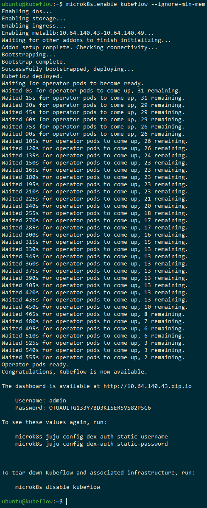

# Kubeflow deploy on Windows through Microk8s

Following tutorial (based on the [guide from Canonical](https://ubuntu.com/tutorials/deploy-kubeflow-ubuntu-windows-mac#1-overview)) is composed of the steps that allowed me to deploy Kubeflow on my local machine with a Windows 10 Pro OS.

Since version 1.3 of the Kubeflow documentation, the OS based instructions seem to disappear, and [version 1.2](https://v1-2-branch.kubeflow.org/docs/started/workstation/getting-started-windows/) does not provide enough details.

## Prerequisites 

* Windows 10 Pro
* minimum of 16 GB RAM, 4 CPU and 50 GB disk
* Hyper-V (not available on Windows 10 Home)

## Installation steps

1. Install [Multipass](https://multipass.run/) (`1.6.2` in my case)  basing on Hyper-V
2. Deploy Kubeflow: `multipass launch --name kubeflow --mem 8G --disk 50G --cpus 4` _(in my case of 16 GB RAM machine, allocation of more than 8 GB memory results in a crash ([times out](https://github.com/canonical/multipass/issues/706)))_
3. Enter this VM: `multipass shell kubeflow`
4. Install Microk8s: `sudo snap install microk8s --classic`
5. Verify success of the installation: `sudo microk8s status --wait-ready`
6. Join the “microk8s” group:
   * `sudo usermod -a -G microk8s $USER`
   * `sudo chown -f -R $USER ~/.kube`
7. Exit and re-enter the Ubuntu session for permissions to take effect:
   * `exit`
   * `multipass shell kubeflow`
8. Enable dns, dashboard and storage services: `microk8s.enable dns dashboard storage`
9. Start Kubeflow (can take several minutes): `microk8s.enable kubeflow --ignore-min-mem` _(the included flag ignores warnings about the required 8 GB of memory)_
10. The deployment is successful once you see the `Operator pods ready.` message
   * In a new command prompt you can keep track of the status of this process with `microk8s.kubectl get all --all-namespaces`
   * Once it is 100% ready, the output should look similar to this screenshot:

  

11. Take a note of the URL, username and password. You can also check the login credentials with a command:
   * admin: `microk8s juju config dex-aafter it's done, you shall see the dashboarduth static-username`
   * password: `microk8s juju config dex-auth static-password` 

### Accessing the dashboard

On Ubuntu, you would simply open the link: [http://10.64.140.43.xip.io](http://10.64.140.43.xip.io)

However, on Windows it is a bit more complicated (we need to create a SOCKS proxy to access the Kubeflow dashboard):
1. Exit the VM: `exit`
2. Find IPv4 (machine_public_ip): `multipass info --all`
3. Re-establish connection to the machine using ssh, enabling SOCKS proxy with the -D9999 parameter: `ssh -i C:\Windows\System32\config\systemprofile\AppData\Roaming\multipassd\ssh-keys\id_rsa -D9999 ubuntu@<machine_public_ip>`
4. Outside the terminal, navigate to `Internet Options` > `Connections` > `LAN settings`
5. Check `Use a proxy server for your LAN...`
6. Hit `Advanced`
7. Remove everything for HTTP, Secure and FTP types
8. For Socks, enter: `127.0.0.1` and `9999`
9. Hit `OK` > `OK` > `OK`
10. Open the dashboard link (received after deploying Kubeflow) and input login credentials

### Cleaning up

1. To tear down Kubeflow and associated infrastructure, run: `microk8s disable kubeflow`
2. To delete VM used for Kubeflow:
   * `multipass delete kubeflow`
   * `multipass purge`

### Other installation options

If the steps above did not work:
* Try other ways of installing Kubeflow locally. Currently, they are still described in [version 1.2](https://v1-2-branch.kubeflow.org/docs/started/workstation/getting-started-windows/) of Kubeflow documentation; however, first check if [the current version](https://www.kubeflow.org/docs/started/installing-kubeflow/) includes them
* Get a Linux OS machine. You may also try running Linux based instructions on Windows through WSL2 or VirtualBox with Ubuntu
* Have a look at [other distributions supporting Kubeflow](https://www.kubeflow.org/docs/distributions/)
* Practice Kubeflow in an online interactive shell on [Katacoda](https://www.katacoda.com/kubeflow) (free). You may also find more exercises on the paid [O'Reilly learning platform](https://learning.oreilly.com/home/)

## Contributing
If there are any issues/improvements that you would like to include, feel free to [create a pull request](kubeflow_deploy_on_windows/pulls).
